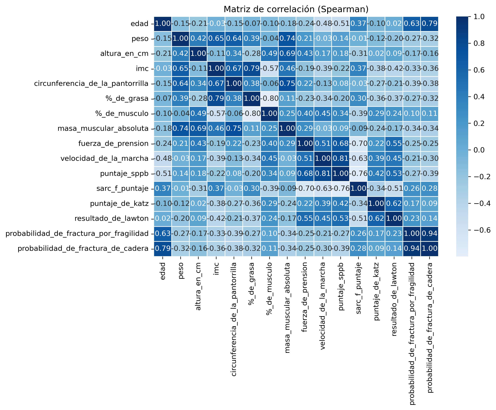

# Análisis de correlación entre variables clínicas y funcionales.

**Estudio:** Osteosarcopenia Escuinapa sinaloa. 
**Responsable clínico:** Dr. Arturo José Rizo Topete.
**Análisis estadístico:** Christian Campos Regalado.

---

## Introducción.

Este análisis se presenta como un **complemento transversal** al estudio original de osteosarcopenia. A diferencia del análisis exploratorio e inferencial previo, que estuvo estrictamente estructurado en torno a los objetivos clínicos específicos, este infrome **no responde a preguntas definidas por el protocolo original**, sino que busca descubrir relaciones estadísticas entre variables numéricas y ordinales.

El objetivo es identificar patrones asociados entre indicadores clínicos, funcionales y antropométricos que podrían ser relevantes para futuras hipótesis, validaciones clínicas o enfoques complementarios al diagnóstico de sarcopenia y osteoporosis.

>*Este análisis no pretende establecer causalidad ni confirmar supuestos clínicos, sino simplemente describir dependencias estadísticas presentes en la muestra estudiada.*

---

## Metodología

- Se utilizó el dataset clínico obtenido através de la limpieza de datos.
- Se seleccionaron variables numéricas y ordinales relevantes de distintas dimensiones:
    - Edad y composición corporal
  - Masa muscular
  - Función física
  - Escalas de funcionalidad
  - Riesgo de fractura (FRAX)
- Se calculó la matriz de correlación de Spearman, por ser robusta frente a distribuciones no normales.
- Si visualizó la matriz como heatmap anotaado para facilitar la interpretación clínica.

---

| Categoría             | Variables incluidas                                          |
|-----------------------|--------------------------------------------------------------|
| Edad / antropometría  | `edad`, `peso`, `altura_en_cm`, `imc`, `circunferencia_de_la_pantorrilla` |
| Composición corporal  | `%_de_grasa`, `%_de_musculo`, `masa_muscular_absoluta`       |
| Función física        | `fuerza_de_prension`, `velocidad_de_la_marcha`, `puntaje_sppb` |
| Indicadores clínicos  | `sarc_f_puntaje`, `puntaje_de_katz`, `resultado_de_lawton`    |
| Riesgo de fractura    | `probabilidad_de_fractura_por_fragilidad`, `probabilidad_de_fractura_de_cadera` |

---

### Matriz de correlación (Spearman)

---

## Resultados e interpretación.

### 1. Edad y riesgo de fractura.
- **Edad vs. fractura de cadera:** ρ = **0.79**
- **Edad vs. fractura por fragilidad:** ρ = **0.63**

Existe una fuerte asociación positiva entre la edad y el riesgo de fractura, en particular de cadera. Esto es consistente con lo esperado clínicamente.

### 2. Composición corporal.
- **IMC vs. % de grasa:** ρ = **0.71**
- **IMC vs. masa muscular:** ρ = **0.67**

Se observan relaciones esperadas entre indicadores de composición corporal. El IMC se asocia tanto a masa grasa como muscular, lo que sugiere que no distingue con precisión entre tipos de tejido.

### 3. Masa muscular.
- **Masa muscular vs. % músculo:** ρ = **0.71**
- **Masa muscular vs. circunferencia de pantorrilla:** ρ = **0.67**
- **Masa muscular vs. fuerza de prensión:** ρ = **0.55**

La masa muscular absoluta se asocia positivamente con medidas antropométricas y funcionales, validando su utilidad como indicador del estudio muscular.

### 4. Funcionalidad física.
- **SPPB vs. velocidad de marcha:** ρ = **0.81**
- **SPPB vs. fuerza de prensión:** ρ = **0.68**
- **SPPB vs. Lawton:** ρ = **0.62**

El puntaje SPPB muestra alta correlación con pruebas físicas específicas y escalas funcionales, consolidándolo como índice integral del estado funcional.

### 5. Escalas funcionales.
- **Lawton vs. Katz:** ρ = **0.53**
- **Lawton vs. SPPB:** ρ = **0.62**

Las escalas funcionales se relacionan entre sí, aunque Lawton parece ser más sensible que Katz a la variabilidad funcional, lo cual coincide con hallazgos inferenciales previos.

---

## Conclusión.

el análisis de correlación permite identificar relaciones estadísticas coherentes con el conocimiento clínico actual y refuerza algunos patrones observados en el estudio original.

Las correlaciones más destacadas involucran:
- La edad como factor de riesgo de fractura.
- La masa muscular como indicador funcional.
- El puntaje SPPB como medida central de funcionalidad.

Estos hallazgos no responden directamente al los objetivos clínicos planteados, pero pueden orientar nuevas hipótesis o herramientas de evaluación funcional dentro del marco de la osteosarcopenia.