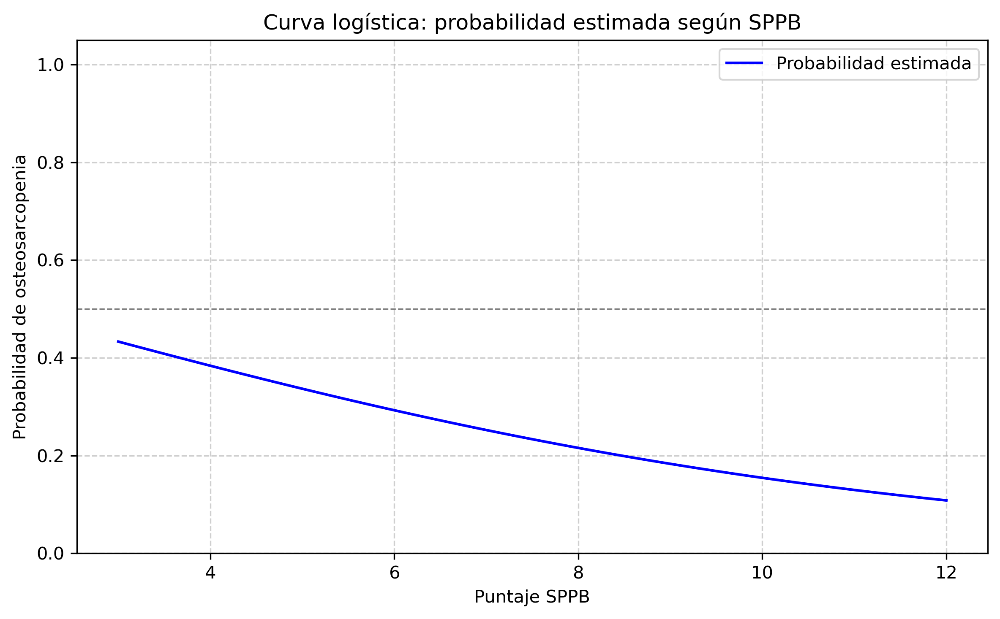
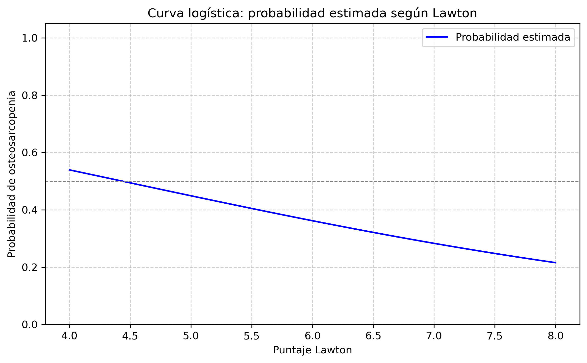
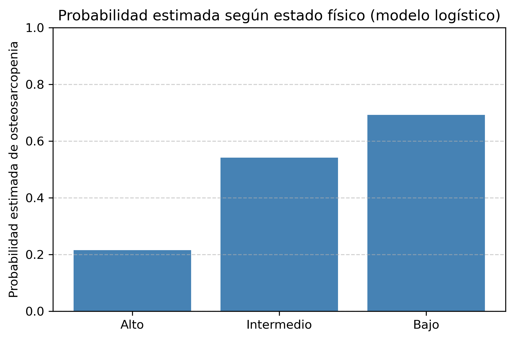

# Informe de regresión logística funcional

**Estudio:** Osteosarcopenia en Escuinapa, Sinaloa.
**Responsable del estudio:** Dr. Arturo José Rizo Topete.
**Análisis estadístico:**
Christian Campos Regalado.

---

## Objetivo del análisis

Este informe presenta un modelo de regresión logística binaria con el fin de estimar la probabilidad de osteosarcopenia a partir de variables funcionales clave. Se trata de un análisis complementario al estudio exploratorio, inferencia y de correlación previamente realizado. El enfoque aquí es predictivo y explicativo, útil como base para futuras hipótesis clínicas.

---

## Variables incluidas

Dado el tamaño de la muestra (n = 53), se optó por un modelo parsimonioso que incluyera sólo tres predictores, seleccionados por su relevancia clínica y su significancia previa en análisis estadísticos:

- _Estado físico_.
- _Puntaje SPPB_.
- _Puntaje Lawton_.

---

## Interpretación de odds ratios (OR)

El modelo calcula odds ratios (razones momios) para cada variable. Estas expresan cuántas veces se incrementa o disminuye la probabilidad de presentar osteosarcopenia según el valor de la variable.

* Un OR > 1 indica mayor riesgo.
* Un OR < 1 indica menor riesgo.
* Un OR = 1 indica que no hay efecto.

---

## Resultados del modelo

| Variable                 | OR   | IC 95%        | p-valor |
| ------------------------ | ---- | ------------- | ------- |
| Estado físico intermedio | 4.29 | 0.39 – 47.53  | 0.235   |
| Estado físico bajo       | 8.19 | 0.16 – 409.19 | 0.292   |
| Puntaje SPPB             | 0.81 | 0.43 – 1.55   | 0.532   |
| Puntaje Lawton           | 0.70 | 0.26 – 1.85   | 0.467   |

📌 *Nota:* Los intervalos de confianza al 95% indican el rango en el cual se espera que se encuentre la verdadera odds ratio con un 95% de certeza estadística. Cuando este intervalo incluye el valor 1, no puede afirmarse que exista un efecto significativo.

Aunque las variables **no son estadísticamente significativas** individualmente (p > 0.05), el modelo completo sí lo es (LLR p-value = 0.0002), lo cual sugiere que, en conjunto, estas variables funcionales aportan información relevante sobre el riesgo de osteosarcopenia.

---

## Visualizaciones derivadas del modelo

### 1. Curva logística: SPPB

Se observa una relación inversa: a mayor puntaje SPPB (mejor funcionalidad física), menor es la probabulidad estimada de osteosarcopenia.

### 2. Curva logística de Lawton

También muestra una relación decreciente: a mayor autonomía en actividades instrumentales, menor es la probabilidad estimada.

### 3. Estado físico: predicción por categoría

Este gráfico muestra que los pacientes con estado físico intermedio y bajo tienen mayor probabilidad estimada de osteosarcopenia en comparación con quienes presentan estado físico alto.

---

## Conclusiones
El modelo sugiere que las variables funcionales: estado físico global, SPPB y Lawton, pueden estar asociadas a la presencia de osteosarcopenia.

Si bien ninguna variable fue significativa por sí sola, el modelo global fue estadísticamente significativo, lo que permite considerar estos factores como potenciales indicares clínicos.

Estos hallazgos deben considerarse como exploratorios debido al tamaño de la muestra. Se recomienda reaplicar el análisis con un mayor número de pacientes antes de establecer criterios diagnósticos.